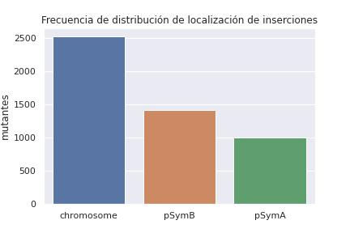
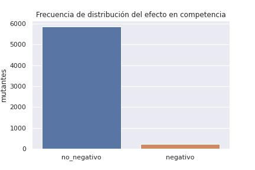
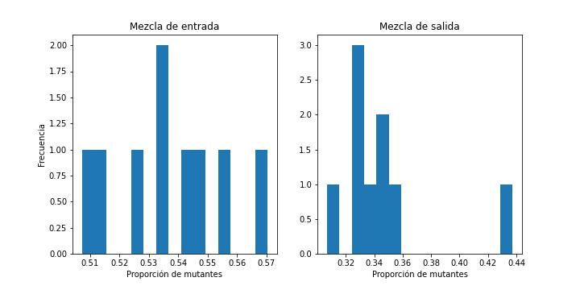
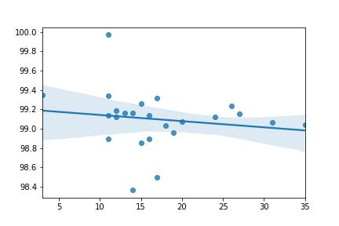

# **Trabajo final HdE**

Los rizobios son bacterias con la capacidad de fijar N2 como amonio cuando están asociados simbióticamente con raíces de plantas leguminosas. Si bien la fijación de nitrógeno se produce en estructuras radiculares especializadas (nódulos fijadores de nitrógeno), estas bacterias también tienen una etapa de vida libre en la que se hallan en mayor concentración en la rizósfera, definida como el volumen de suelo afectado directamente por las raíces de las plantas.

Para este trabajo se utilizan datos de 2 ensayos en los que se evalua la competencia por la colonización de la rizosfera de *Medicago sativa* por mutantes de *Sinorhizobium meliloti*. 

Estos mutantes fueron generados mediante la tecnología de mutagénesis etiquetada por firmas (STM, *Signature Tagged Mutagenesis*), por lo que cada uno lleva una marca genética que permite identificarlo y cuantificarlo en ensayos realizados con mezclas de mutantes, mediante el uso de técnicas de secuenciación masiva.

## **1. Análisis estadístico de datos categóricos**

En este caso se utilizó una tabla que cuenta con resultados de ensayos de competencia por la colonización rizosférica en la que se inocularon macetas de alfalfa con *pooles* de mutantes. Para cada uno de los mutantes (columna 'mutant_ID') se registran dos valores M que hacen referencia a la diferencia en la representación de cada una de las dos firmas genéticas (obtenida por secuenciamiento de las dos etiquetas presentes en cada mutante) en la mezcla de mutantes en el inóculo y en la mezcla obtenida al final del ensayo. Cada uno de estos valores M (columnas '7dpiAlfL_KValor M' y '7dpiAlfL_HValor M') está asociado a un p-value (columnas '7dpiAlfL_Kt-test' y '7dpiAlfL_Ht-test') y la columna 'contig' contiene la porción del genoma en la que está ubicada la inserción del transposón.

Con el fin de determinar si existe una relación entre la ubicación de la mutación (cromosoma(3,65Mpb), plásmidos pSymA(1,35Mpb) o pSymB(1,68Mpb)) y el efecto en la competencia, se clasificaron los mutantes en dos categorías, los afectados negativamente ('negativo'), aquellos que presentaron valores M<-0,7 y un p-value < 0,1 tanto en la firma K como en la firma H (exigencia de consistencia en el resultado observado desde ambas firmas), y 'no_negativo' a aquellos que no cumplen esta condición.

Para esto se plantea la hipótesis nula: No existe una relación entre la ubicación de la mutación en el genoma y el efecto en la competencia de los mutantes. Luego se realiza un test para probar esta hipótesis.

### **Frecuencia de distribución de las dos variables (localización y efecto en competencia)**
\

Para determinar si la ubicación de las mutaciones tiene una relación con el efecto que genera en la competencia, se realizó una tabla de contingencia en la que se compara el número de mutantes afectado en colonización en relación a la ubicación en el genoma de la inserción del transposón.

|contig | afectado    |    |
| ------------- |------------| -----:|
|Plásmidos |No negativo    |   2407|
|      |Negativo     |     22|
|Cromosoma  |  No negativo    |   2380|
|      |  Negativo     |    150|

Luego se realizó un test de Chi cuadrado para evaluar la hipótesis, ya que se busca determinar la dependencia de dos variables discretas. Esto que dió como resultado los siguientes valores.

|statistic | p-value |
|:-------------:|:-------------:|
|4301.76    |   0.0|

Esto podría indicar un mayor número de genes en el cromosoma que cumplen una función importante en la competencia en relación al número total de genes que pueden ser afectados sin generar una deficiencia vital en el crecimiento de la bacteria.

Teniendo en cuenta que se conoce que el plásmido pSymA no cumple una función fundamental en el desarrollo de la simbiosis, la tabla fue filtrada para contemplar sólo los mutantes afectados en el cromosoma y en el plásmido pSymB.

|contig | afectado    |    |
| ------------- |------------| -----:|
|pSymB |No negativo    |   1403|
|      |Negativo     |     19|
|Cromosoma  |  No negativo    |   2380|
|      |  Negativo     |    150|

Evaluando estos datos con un test de Chi cuadrado se obtuvieron los siguientes resultados

|statistic | p-value |
|:-------------:|:-------------:|
|3796.65    |   0.0|

Lo que permite inferir que las inserciones cromosomales tienen una mayor probabilidad de generar mutantes viables con relevancia en la competencia respecto a las localizadas en el plásmido pSymB.

## **2. Análisis estadístico de datos continuos**

En este caso se utilizó una tabla con datos de un ensayo de competencia pero a diferencia del ensayo analizado en la sección anterior, realizado con pooles de mutantes, este experimento se realizó inoculando plantas de alfalfa con una mezcla en proporción 1:1 de uno de los mutantes y la cepa salvaje. Para esto se cuantificó la proporción de mutantes mediante recuento en placa del inóculo (mezcla de entrada) y de las bacterias laxamente asociadas a la raíz 7 días post inoculación (mezcla de salida) en el cual se puede diferenciar la cepa salvaje por la expresión constitutiva de gfp.

|    |   entrada_mut |   entrada_wt |   salida_mut |   salida_wt |
|---:|--------------:|-------------:|-------------:|------------:|
|  0 |           128 |          112 |           45 |          82 |
|  1 |            81 |           61 |           46 |          93 |
|  2 |            76 |           63 |           61 |         117 |
|  3 |           105 |          102 |           63 |          81 |
|  4 |            58 |           49 |           39 |          81 |
|  5 |           180 |          162 |           50 |         113 |
|  6 |           109 |          103 |           35 |          72 |
|  7 |            93 |           81 |           58 |         108 |
|  8 |            69 |           55 |           63 |         125 |

Para realizar el análisis se calcula la proporción de mutantes en el inóculo y luego del ensayo de competencia:

$$ proporcion\_entrada = {entrada\_mut \over entrada\_mut + entrada\_wt} $$

$$ proporcion\_salida = {salida\_mut \over salida\_mut + salida\_wt} $$

Se grafica la distribución de las proporciones

Se calculan las medidas características de la distribución:

|                     |   proporcion_entrada |   proporcion_salida |
|:--------------------|---------------------:|--------------------:|
| media               |          0.536802    |          0.345424   |
| mediana             |          0.534483    |          0.335106   |
| rango               |          0.0631762   |          0.130752   |
| RI                  |          0.0204468   |          0.0222948  |
| desviación estandar |          0.0198659   |          0.0373255  |
| varianza            |          0.000394655 |          0.00139319 |
| CV                  |          0.0370079   |          0.108057   |
| skewness            |          0.165462    |          2.17793    |
| kurtosis            |         -0.313466    |          5.70437    |

Se evalúa la homocedasticidad con el test de Levene:

|statistic | p-value |
|:-------------:|:-------------:|
|0.345   |   0.56|

El resultado del test indica se puede suponer igualdad de varianzas, es decir, se cumple el supuesto de homocedasticidad

Utilizando el test de Shapiro se evalua la normalidad de la distribución de la población.
||statistic | p-value |
|:--------|:-------------:|:-------------:|
|proporcion_entrada|0.996  |   0.987|
|proporcion_salida|0.760    |   0.007|

Los valores obtenidos para los datos de proporción de salida indican que no sigue una distribución normal por lo que se buscan outliers en este set de datos calculando el z-score para cada valor y con un valor límite de 3. Y al no poder descartar ningún resultado se evalúa la diferencia de intercuartilos con el mismo fin y aun así no se puede descartar ningún valor. 

Teniendo esto en cuenta se determina el tamaño muestral necesario asumiendo normalidad, resultando en 699 muestras necesarias para este ensayo.

Dado que operativamente no se puede realizar ese número de repeticiones, se elige utilizar un test no paramétrico, el test de Kolmogorov-Smirnov para dos muestras

|statistic | p-value |statistic_location|statistic_sign|
|:--------:|:-------:|:----------------:|:------------:|
|1.0       |4.11e-05 |0.4375            |-1            |

Con un p-value menor a 0.05 se descarta la hipótesis nula, y se puede asumir que la muestra de entrada y salida son distintas.

En este caso los valores obtenidos en el ensayo tal vez tuvieron un sesgo debido a las condiciones operativas en las que se realizaron las réplicas, lo que probablemente pudo influir en la dispersión de los valores de proporción en la mezcla de salida. Aun con esta dificultad se pudo demostrar una diferencia estadísticamente significativa entre la proporción inicial y final.

## 3.Regresión lineal

Con el fin de analizar una posible correlación entre la similitud de genomas de cepas de *S. meliloti* y las cantidades de secuencias de inserción diferencialmente ubicadas frente a la cepa de referencia *S. meliloti* 1021 se realizó un análisis de regresión lineal comparando el recuento de IS's y el ANI (*Average Nucleotide Identity*)

Para esto se calcula el coeficiente de correlación de Person

|statistic | p-value |
|:-------------:|:-------------:|
|-0.154  |   0.47|

El valor negativo de r (-0.154), indica una correlación negativa, lo que se podría interpretar como una mayor presencia de IS's diferenciales cuanto menor sea la similitud de los genomas, aunque la probabilidad que este fenómeno sea explicado por una correlación lineal es de 0.47, siendo este un valor muy bajo.
